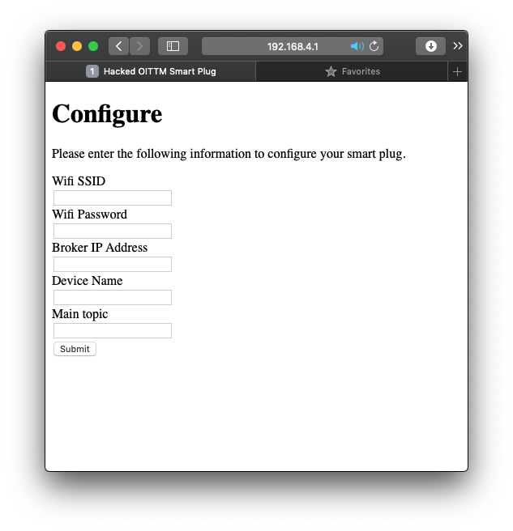
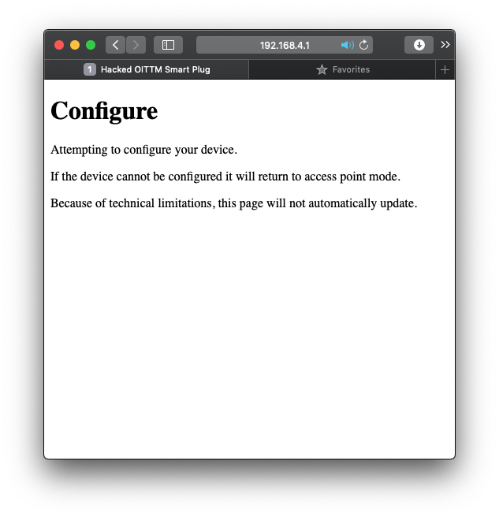

# Oittm Smart Plug Hack

Yet another ESP8266-based smart plug hack. This one is on the Oittm Smart Plug I purchased some time ago on Amazon.


I referenced [this Not Enough Tech article](<>) which walks you through exactly how to get access to the ESP8266. From there, I began to code.

## User Interface

### Configuration Page

This is an MQTT-based hack.

To that end, the smart plug starts in access point mode and serves the following pages via HTTP&#x3A;



After entering the config information and clicking `Submit`, the smart plug displays the following message:



The smart plug will then restart and attempt to connect to WiFi and the MQTT broker. If successful, it will continue to function. If unsuccessful, it will restart in access point mode and you can try again.

### Hard Reset

Pushing the button 10 times quickly (&lt; 3 s) will cause the smart plug to reboot.

### MQTT

When connected to WiFi and the MQTT broker, it can then be fully controlled via MQTT publishes to the following:

| Verb      | Topic               | Message       | Result                                        |
| --------- | ------------------- | ------------- | --------------------------------------------- |
| Publish   | `main_topic/set`    | `on` or `off` | Outlet is turned `on` or `off`, respectively  |
| Publish   | `main_topic/toggle` | don't care    | Outlet state is toggled                       |
| Subscribe | `main_topic`        | `on` or `off` | observed on state changes, with updated state |

## Hardware Requirements

-   ESP8266-based smart plug
-   micropython v1.12 or newer

If using a different smart plug, edit `src/smart_plug.py` to control the specifics of your device.

## Installation

From a fresh flash of micropython, copy all files from `src/` onto the microcontroller.

I use [rshell](https://github.com/dhylands/rshell).

```shell
# from rshell,
# with file system mounted to /pyboard:

cd path/to/project
cd src
cp -r http   /pyboard
cp -r states /pyboard
cp    *.py   /pyboard
```

## Code

### State Diagram

The operation is summarized by the state diagram, below.


### HTTP Server

I micro-HTTP server is included in `src/http`. This server is just "big" enough to handle this application.

It is not considered a complete or secure HTTP implementation.

### MQTT Server

As this hack uses MQTT, it requires access to a broker (server) on your network. MQTT is configured along with WiFi via the configuration page.

All MQTT settings are ultimately editable in `src/mqtt.py`.
